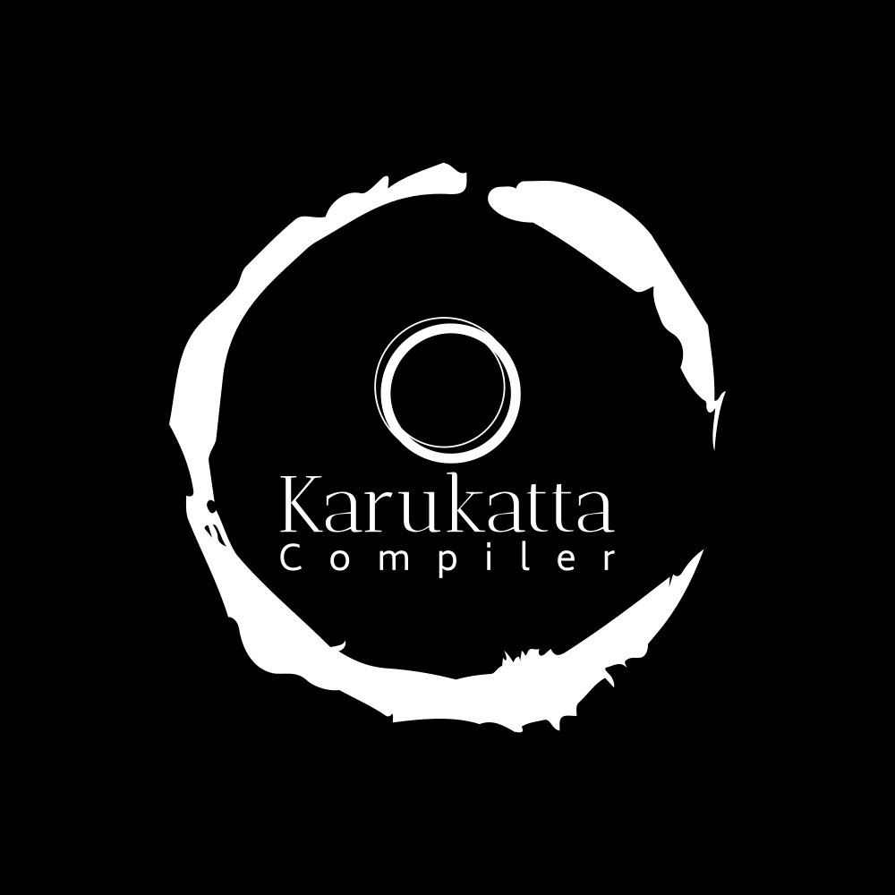

# Karukatta

<div align="center">
    
</div>

A compiled programming language that generates native machine code with built-in obfuscation. No assembler, no linker - just raw bytes straight to an executable.

Targets both **x86-64 Linux** and **ARM64 macOS** (Apple Silicon).

## What is this?

Karukatta is a small language I built to explore how compilers actually work under the hood - from parsing all the way down to encoding individual machine instructions. The twist: every binary it produces can be obfuscated out of the box. Control flow flattening, dead code injection, instruction substitution - all built into the compiler pipeline.

The compiler does everything itself. On Linux, it writes ELF binaries directly (no NASM, no LD, nothing). On macOS, it emits raw ARM64 machine code and hands it to the system linker for code signing.

## Quick start

```bash
git clone https://github.com/IR0NBYTE/Karukatta.git
cd Karukatta
./runner.sh
```

Write a program:

```kar
let a = 5;
let b = 3;
let result = a * 2 + b;
exit(result);  // exits with 13
```

Compile and run:

```bash
./build/karukatta program.kar -o program
./program
echo $?  # 13
```

Compile with obfuscation:

```bash
# level 1: instruction substitution
./build/karukatta program.kar -o program --obf=1

# level 2: control flow flattening + dead code injection
./build/karukatta program.kar -o program --obf=2

# different seed = different binary, same behavior
./build/karukatta program.kar -o program --obf=2 --seed=1337
```

## The language

Pretty minimal right now - integers, variables, comparisons, branching, loops.

```kar
let score = 75;

if (score >= 90) {
    exit(1);  // A
} else {
    if (score >= 70) {
        exit(2);  // B
    } else {
        exit(3);  // C
    }
}
```

```kar
// all the comparison operators work
let a = 10;
let b = 20;
let eq = a == b;   // 0
let ne = a != b;   // 1
let lt = a < b;    // 1
let sum = eq + ne + lt;
exit(sum);  // 2
```

```kar
// while loops
let flag = 1;
while (flag) {
    exit(42);
}
```

**What's supported:**
- `let` bindings (immutable)
- `+` `-` `*` `/` arithmetic
- `==` `!=` `<` `<=` `>` `>=` comparisons
- `if` / `else` 
- `while` loops
- `{ }` scoped blocks with variable shadowing
- `//` comments
- `exit(n)` to set the process exit code

**What's not there yet:**
- Functions
- Strings
- Arrays
- Mutable variables
- Standard library

## How the compiler works

```
source.kar
    |
    v
 [Lexer]     tokenizes the source
    |
    v
 [Parser]    builds an AST (Pratt parsing for expressions)
    |
    v
 [IR]        lowers to three-address code with virtual registers
    |
    v
 [Passes]    optimization + obfuscation (if enabled)
    |
    v
 [Backend]   encodes to real machine instructions
    |         (x86-64: REX + opcode + ModR/M + SIB)
    |         (ARM64: fixed 32-bit instruction encoding)
    v
 [Emitter]   wraps in ELF (Linux) or Mach-O (macOS)
    |
    v
 executable
```

No external tools in the pipeline for Linux - the compiler literally writes the ELF header, program headers, and machine code bytes into a file. That's your binary.

## Obfuscation

This is the fun part. The compiler has an IR pass system, and some of those passes exist purely to make the output harder to reverse engineer.

**`--obf=1`** - Instruction substitution. Simple operations get replaced with equivalent but more complex sequences. `ADD a, b` might become `SUB a, NEG(b)` or `a + b + noise - noise`. Each compilation with a different `--seed` picks different substitutions.

**`--obf=2`** - Everything from level 1, plus control flow flattening and dead code injection. CFF rewrites all the basic blocks into a state-machine dispatcher - every block transition goes through a central switch on a randomized state variable. Dead code insertion sprinkles fake computations throughout that execute but don't affect output.

The result: same source code, wildly different binary each time. Try it:

```bash
./build/karukatta example.kar -o bin1 --obf=2 --seed=111
./build/karukatta example.kar -o bin2 --obf=2 --seed=222

# both produce the same exit code, but:
diff <(xxd bin1) <(xxd bin2)  # completely different binaries
```

## Cross-compilation

The compiler auto-detects your platform, but you can target explicitly:

```bash
# compile for x86-64 Linux (produces a standalone ELF, no dependencies)
./build/karukatta program.kar -o program --target=x86_64-linux

# compile for ARM64 macOS
./build/karukatta program.kar -o program --target=arm64-macos

# dump the IR to see what the compiler is doing
./build/karukatta program.kar -o program --dump-ir
```

## Building

You just need a C++17 compiler. That's it.

```bash
./runner.sh
```

Or manually:

```bash
g++ -std=c++17 main.cpp -o build/karukatta
```

To test Linux binaries on macOS, use Docker:

```bash
./build/karukatta program.kar -o build/program --target=x86_64-linux
docker run --rm -v $(pwd)/build:/app ubuntu:22.04 sh -c '/app/program; echo $?'
```

## Project layout

```
Karukatta/
├── main.cpp                 # compiler driver + CLI
├── pkg/
│   ├── lexer.hpp            # tokenizer
│   ├── parser.hpp           # recursive descent + Pratt parsing
│   ├── arena.hpp            # bump allocator for AST nodes
│   ├── ir.hpp               # intermediate representation
│   ├── ir_builder.hpp       # AST -> IR lowering
│   ├── target/
│   │   ├── x86_64.hpp       # x86-64 instruction encoder
│   │   └── arm64.hpp        # ARM64 instruction encoder
│   ├── emit/
│   │   ├── elf.hpp          # ELF64 binary writer
│   │   └── macho.hpp        # Mach-O binary writer
│   └── passes/
│       ├── pass.hpp          # pass interface + seeded RNG
│       ├── cff.hpp           # control flow flattening
│       ├── insn_sub.hpp      # instruction substitution
│       └── dead_insert.hpp   # dead code insertion
├── example/                  # test programs
├── docs/                     # language spec + architecture docs
└── runner.sh                 # build script
```

## Grammar

```ebnf
program     ::= statement*
statement   ::= exit_stmt | let_stmt | scope | if_stmt | while_stmt
exit_stmt   ::= "exit" "(" expression ")" ";"
let_stmt    ::= "let" identifier "=" expression ";"
scope       ::= "{" statement* "}"
if_stmt     ::= "if" "(" expression ")" scope ("else" scope)?
while_stmt  ::= "while" "(" expression ")" scope
expression  ::= term (operator term)*
operator    ::= "+" | "-" | "*" | "/" | "==" | "!=" | "<" | "<=" | ">" | ">="
term        ::= integer_literal | identifier | "(" expression ")"
```

## License

MIT
